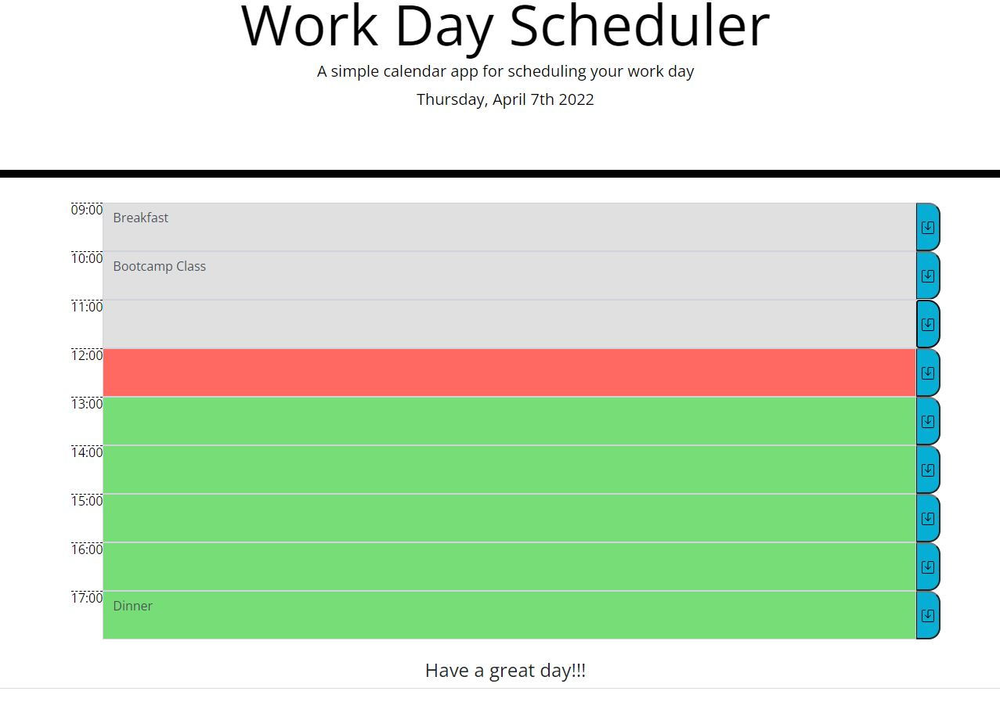

# WorkDayScheduler
I built a workday planner for this project. I used a bootstrap template for the body and manipulated the html with js and jQuerry. Please see below image for a screenshot from the final look. Clor gray represents past, red is current and green is future hours. 

I followed below criteria:

GIVEN I am using a daily planner to create a schedule
WHEN I open the planner
THEN the current day is displayed at the top of the calendar
WHEN I scroll down
THEN I am presented with timeblocks for standard business hours
WHEN I view the timeblocks for that day
THEN each timeblock is color coded to indicate whether it is in the past, present, or future
WHEN I click into a timeblock
THEN I can enter an event
WHEN I click the save button for that timeblock
THEN the text for that event is saved in local storage
WHEN I refresh the page
THEN the saved events persist

links to my project:

GitHub
https://github.com/sevalc/WorkDayScheduler/settings/pages

URL
https://sevalc.github.io/WorkDayScheduler/
